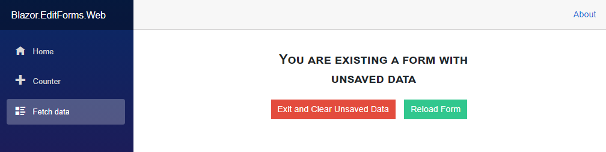
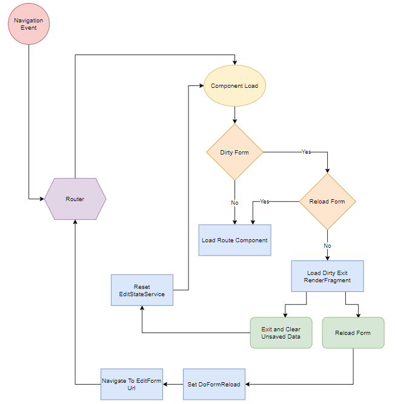
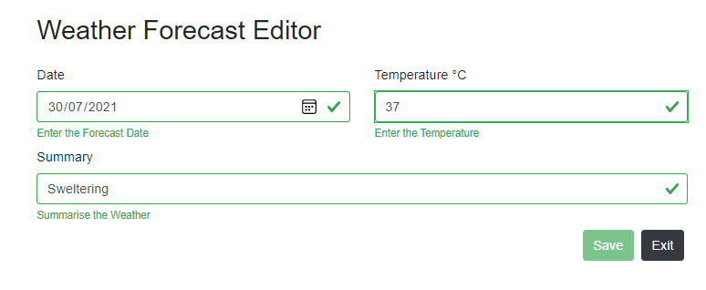
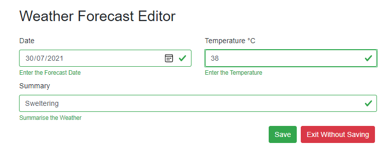
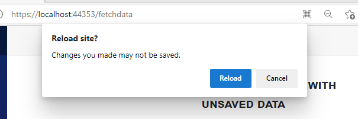

# Managing Form Edit State in Blazor

You've edited data in a form.  You inadvertently click on a link in the navigation bar, click the back button, hit a favourite link.  Do you really want to exit the form and go to where you've told the browser to go to.  Maybe, maybe not.  What you probably want is to be warned about your unsaved data, and given the option to return or discard.



This Repo shows how to implement just that in Blazor.

There's currently a Azure Site that demos the code - [Blazor-EditForms](https://blazor-editforms.azurewebsites.net/)

## Form Exits

There are three (controlled) ways a user can exit a form:
1. Intra Form Navigation - Clicking on an Exit button within the Form.
2. Intra Application Navigation - Clicking on a link in a navigation bar outside the form, clicking on the forward or back buttons on the browser.
3. Extra Application Navigation - entering a new Url in the address bar, clicking on a favourite, closing the browser Tab or application.

We have no control over killing the browser - say a reboot or system crash - so I won't consider that here.

## Form Edit State

Before we implement code to address these exit paths we need to track edit state - are any of the current entered values different from the stored values?  Out-of-the-box Blazor has no controls to do this.

### EditStateService

`EditStateService` is a scoped service state container.  It contains the information needed to track edit state in the application.

```csharp
public class EditStateService
{
    public object RecordID { get; set; }
    public bool IsDirty { get; set; }
    public string Data { get; set; }
    public string EditFormUrl { get; set; }
    public bool ShowEditForm => (!String.IsNullOrWhiteSpace(EditFormUrl)) && IsDirty;
    public bool DoFormReload { get; set; }
    public event EventHandler RecordSaved;

    public void SetEditState(string data)
    {
        this.Data = data;
        this.IsDirty = true;
    }

    public void ClearEditState()
    {
        this.Data = null;
        this.IsDirty = false;
    }

    public void ResetEditState()
    {
        this.RecordID = null;
        this.Data = null;
        this.IsDirty = false;
        this.EditFormUrl = string.Empty;
    }

    public void NotifyRecordSaved()
        => RecordSaved?.Invoke(this, EventArgs.Empty);
}
```

### EditFormState

`EditFormState` is a UI control that tracks the user entered values against the original values in the model.  The code is too long to reproduce in it's entirity.  You can view the code in the repository.

It's a UI control with no UI output - like `EditForm`.  It's placed within an `EditForm` and gets the cascaded `EditContext`.  It gets the `EditStateService` through dependency injection and exposes an `EditStateChanged` event and an `IsDirty` property. 

It gets the model from the `EditContext` and saves the model write properties to an `EditFields` collection.

`EditField` looks like this.  Note all but `EditedValue` are `init` record type properties.

```csharp
    public class EditField
    {
        public string FieldName { get; init; }
        public Guid GUID { get; init; }
        public object Value { get; init; }
        public object EditedValue { get; set; }
        public object Model { get; init; }

        public bool IsDirty
        {
            get
            {
                if (Value != null && EditedValue != null) return !Value.Equals(EditedValue);
                if (Value is null && EditedValue is null) return false;
                return true;
            }
        }

        public EditField(object model, string fieldName, object value)
        {
            this.Model = model;
            this.FieldName = fieldName;
            this.Value = value;
            this.EditedValue = value;
            this.GUID = Guid.NewGuid();
        }

        public void Reset()
            => this.EditedValue = this.Value;
    }
```

`EditFieldCollection` is an `IEnumerable` implementation.  It provides:
 -  an `IsDirty` property which checks the state of all the `EditFields` in the collection.
 -  a set of getters and setters for adding and setting the edit state. 

```csharp
    public class EditFieldCollection : IEnumerable
    {
        private List<EditField> _items = new List<EditField>();
        public int Count => _items.Count;
        public Action<bool> FieldValueChanged;
        public bool IsDirty => _items.Any(item => item.IsDirty);

        public void Clear()
            => _items.Clear();

        public void ResetValues()
            => _items.ForEach(item => item.Reset());
..... lots of getters and setters and IEnumerator implementation
```

`EditFormState.OnInitializedAsync()`:
1. Loads the properties from `EditContext.Model`.
2. Checks the `EditStateService` and if it's dirty gets and deserializes `Data`.
3. Sets the `EditedValue` for each `EditField` to the saved `Data` value.
4. Applies the saved `Data` values to the `EditContext.Model`.
5. Hooks up `FieldChanged` to `OnFieldChanged` on `EditContext` to get all the user edits.

`EditFormState.FieldChanged` is triggered by a input change:
1. Reads the current `IsDirty`.
2. Gets the property and new value from the `FieldChangedEventArgs`.
3. Sets the `EditField` in the `EditFieldCollection`.
4. Checks if the Edit State has changed and if so invokes the `EditStateChanged` event.
5. Updates the `EditStateService` edit state.  Either updates it if the edit state is dirty or clears it if the edit state is clean.
6. Sets/resets the `PageExitCheck` - more later.


### Extra Site Navigation

This occurs when the user tries to leave the site - closing the browser tab, or clicking on a favourite.  There is no way to stop this directly in Blazor - there's no raised event to link into.  However, the browser does have an event `beforeunload`.  You don't have much control over it, but you can tell the browser to ask the user if they wish to exit the page.

*site.js* defines two functions for adding/removing the event from the browser `window` object.

```js
window.cecblazor_setEditorExitCheck = function (show) {
    if (show) {
        window.addEventListener("beforeunload", cecblazor_showExitDialog);
    }
    else {
        window.removeEventListener("beforeunload", cecblazor_showExitDialog);
    }
}

window.cecblazor_showExitDialog = function (event) {
    event.preventDefault();
    event.returnValue = "There are unsaved changes on this page.  Do you want to leave?";
}
```

This can then be called from Blazor:

```csharp
[Inject] private IJSRuntime _js { get; set; }

private void SetPageExitCheck(bool action)
    => _js.InvokeAsync<bool>("cecblazor_setEditorExitCheck", action);
```

`SetPageExitCheck` is used in setting and clearing the edit state in `EditFormState`

```csharp
private void SaveEditState()
{
    this.SetPageExitCheck(true);
    var jsonData = JsonSerializer.Serialize(this.EditContext.Model);
    EditStateService.SetEditState(jsonData);
}

private void ClearEditState()
{
    this.SetPageExitCheck(false);
    EditStateService.ClearEditState();
}
```

and in `WeatherEditor` to clear the edit state on exitting the form.

```csharp
private void Exit()
{
    this.EditStateService.ResetEditState();
    this.SetPageExitCheck(false);
    NavManager.NavigateTo("/fetchdata");
}
```

### Intra Site Navigation

Intra site navigation is handled by the `Router` defined in `App`.  The actual rendering is handled by `RouteView`.  This is a simpler component to modify than the router.  Our revised process for `RouteView` looks like this:



### RouteViewManager

`RouteViewManager` is based on `RouteView`.

The key sections for loading are:

```csharp
public class RouteViewManager : IComponent
{
    private bool _RenderEventQueued;
    private RenderHandle _renderHandle;

    [Parameter] public RouteData RouteData { get; set; }
    [Parameter] public Type DefaultLayout { get; set; }
    [Inject] private EditStateService EditStateService { get; set; }
    [Inject] private IJSRuntime _js { get; set; }
    [Inject] private NavigationManager NavManager { get; set; }

    public void Attach(RenderHandle renderHandle)
        => _renderHandle = renderHandle;

    public async Task SetParametersAsync(ParameterView parameters)
    {
        // Sets the component parameters
        parameters.SetParameterProperties(this);

        if (RouteData is null && string.IsNullOrWhiteSpace(this.EditStateService.EditFormUrl))
            throw new InvalidOperationException($"The {nameof(RouteView)} component requires a non-null value for the parameter {nameof(RouteData)}.");
        // Render the component
        await this.RenderAsync();
    }

    private RenderFragment _renderDelegate => builder =>
    {
        _RenderEventQueued = false;
        // Adds cascadingvalue for the ViewManager
        builder.OpenComponent<CascadingValue<RouteViewManager>>(0);
        builder.AddAttribute(1, "Value", this);
        // Get the layout render fragment
        builder.AddAttribute(2, "ChildContent", this._layoutViewFragment);
        builder.CloseComponent();
    };

    public async Task RenderAsync() => await InvokeAsync(() =>
    {
        if (!this._RenderEventQueued)
        {
            this._RenderEventQueued = true;
            _renderHandle.Render(_renderDelegate);
        }
    }
    );

    protected Task InvokeAsync(Action workItem) 
        => _renderHandle.Dispatcher.InvokeAsync(workItem);

    protected Task InvokeAsync(Func<Task> workItem) 
        => _renderHandle.Dispatcher.InvokeAsync(workItem);
}
```

We add some button event handlers to handle the two Dirty Form options and a method to set the browser page exit event.

```csharp
private Task DirtyExit(MouseEventArgs e)
{
    this.EditStateService.ClearEditState();
    this.SetPageExitCheck(false);
    return RenderAsync();
}

private void LoadDirtyForm(MouseEventArgs e)
{
    this.EditStateService.DoFormReload = true;
    NavManager.NavigateTo(this.EditStateService.EditFormUrl);
}

private void SetPageExitCheck(bool action)
    => _js.InvokeAsync<bool>("cecblazor_setEditorExitCheck", action);
    }
```

We then have a render fragment to build out the layout which adds either `_dirtyExitFragment` to build the Dirty Exit view or `_renderComponentWithParameters` to build out the route component. 

```csharp
private RenderFragment _layoutViewFragment => builder =>
{
    Type _pageLayoutType = RouteData?.PageType.GetCustomAttribute<LayoutAttribute>()?.LayoutType
        ?? DefaultLayout;

    builder.OpenComponent<LayoutView>(0);
    builder.AddAttribute(1, nameof(LayoutView.Layout), _pageLayoutType);
    if (this.EditStateService.IsDirty && this.EditStateService.DoFormReload is not true)
        builder.AddAttribute(2, nameof(LayoutView.ChildContent), _dirtyExitFragment);
    else
    {
        this.EditStateService.DoFormReload = false;
        builder.AddAttribute(3, nameof(LayoutView.ChildContent), _renderComponentWithParameters);
    }
    builder.CloseComponent();
};

private RenderFragment _dirtyExitFragment => builder =>
{
    builder.OpenElement(0, "div");
    builder.AddAttribute(1, "class", "dirty-exit");
    {
        builder.OpenElement(2, "div");
        builder.AddAttribute(3, "class", "dirty-exit-message");
        builder.AddContent(4, "You are existing a form with unsaved data");
        builder.CloseElement();
    }
    {
        builder.OpenElement(5, "div");
        builder.AddAttribute(6, "class", "dirty-exit-message");
        {
            builder.OpenElement(7, "button");
            builder.AddAttribute(8, "class", "dirty-exit-button");
            builder.AddAttribute(9, "onclick", EventCallback.Factory.Create<MouseEventArgs>(this, this.DirtyExit));
            builder.AddContent(10, "Exit and Clear Unsaved Data");
            builder.CloseElement();
        }
        {
            builder.OpenElement(11, "button");
            builder.AddAttribute(12, "class", "load-dirty-form-button");
            builder.AddAttribute(13, "onclick", EventCallback.Factory.Create<MouseEventArgs>(this, this.LoadDirtyForm));
            builder.AddContent(14, "Reload Form");
            builder.CloseElement();
        }
        builder.CloseElement();
    }
    builder.CloseElement();
};

private RenderFragment _renderComponentWithParameters => builder =>
{
    Type componentType = null;
    IReadOnlyDictionary<string, object> parameters = new Dictionary<string, object>();

    componentType = RouteData.PageType;
    parameters = RouteData.RouteValues;
    if (componentType != null)
    {
        builder.OpenComponent(0, componentType);
        foreach (var kvp in parameters)
        {
            builder.AddAttribute(1, kvp.Key, kvp.Value);
        }
        builder.CloseComponent();
    }
    else
    {
        builder.OpenElement(2, "div");
        builder.AddContent(3, "No Route or View Configured to Display");
        builder.CloseElement();
    }
};
```

## Updating the Data Model

There are sopme changes that we need to make to make this work correctly and add some structure to the data layers.

### WeatherForecast

Add a `Copy` method to create a copy of the instance.

```csharp
public class WeatherForecast
{
    public Guid ID { get; set; }
    public DateTime Date { get; set; }
    public int TemperatureC { get; set; }
    public int TemperatureF => 32 + (int)(TemperatureC / 0.5556);
    public string Summary { get; set; }

    public WeatherForecast Copy()
        => new()
        {
            ID = this.ID,
            Date = this.Date,
            TemperatureC = this.TemperatureC,
            Summary = this.Summary
        };
}
```

### WeatherForecastDataService

The data service.  It builds a list of Weather Forecasts and adds data access methods to get a list, an individual record and update a record.  Note we preserve our original data by using the `Copy` method to get copies to pass to the View Service.

```csharp
public class WeatherForecastDataService
{
    private static readonly string[] Summaries = new[]
    {
        "Freezing", "Bracing", "Chilly", "Cool", "Mild", "Warm", "Balmy", "Hot", "Sweltering", "Scorching"
    };

    private List<WeatherForecast> WeatherForecasts; 

    public WeatherForecastDataService()
        =>  WeatherForecasts = GetForecasts();

    public ValueTask<List<WeatherForecast>> GetWeatherForcastsAsync()
    {
        var list = new List<WeatherForecast>();
        WeatherForecasts.ForEach(item => list.Add(item.Copy()));
        return ValueTask.FromResult<List<WeatherForecast>>(list);
    }

    public ValueTask<WeatherForecast> GetWeatherForcastAsync(Guid id)
    { 
        var record =  WeatherForecasts.FirstOrDefault(item => item.ID == id);
        return ValueTask.FromResult<WeatherForecast>(record.Copy());
    }

    public ValueTask<bool> SaveWeatherForcastAsync(WeatherForecast record)
    {
        var rec = WeatherForecasts.FirstOrDefault(item => item.ID == record.ID);
        if (rec != default)
        {
            rec.Date = record.Date;
            rec.TemperatureC = record.TemperatureC;
            rec.Summary = record.Summary;
        }
        return ValueTask.FromResult<bool>(rec != default);
    }

    private List<WeatherForecast> GetForecasts()
    {
        var rng = new Random();
        return Enumerable.Range(1, 5).Select(index => new WeatherForecast
        {
            ID = Guid.NewGuid(),
            Date = DateTime.Now.AddDays(index),
            TemperatureC = rng.Next(-20, 55),
            Summary = Summaries[rng.Next(Summaries.Length)]
        }).ToList();
    }
}
```

### WeatherForecastViewService

The view service.  It holds the retrieved data with events for data changes.

```csharp
public class WeatherForecastViewService
{
    private List<WeatherForecast> _records;
    private WeatherForecast _record;

    public List<WeatherForecast> Records
    {
        get => this._records;
        private set
        {
            this._records = value;
            ListChanged?.Invoke(this, EventArgs.Empty);
        }
    }

    public WeatherForecast Record
    {
        get => _record;
        set
        {
            this._record = value;
            RecordChanged?.Invoke(this, EventArgs.Empty);
        }
    }

    private WeatherForecastDataService DataService;
    public event EventHandler RecordChanged;
    public event EventHandler ListChanged;

    public WeatherForecastViewService(WeatherForecastDataService dataService)
        => this.DataService = dataService;

    public async ValueTask GetWeatherForcastsAsync()
        => this.Records = await DataService.GetWeatherForcastsAsync();

    public async ValueTask<bool> UpdateRecordAsync()
        =>  await DataService.SaveWeatherForcastAsync(this.Record);

    public async ValueTask GetRecordAsync(Guid id)
        => this.Record = await DataService.GetWeatherForcastAsync(id);
}
```

### ServiceCollectionExtensions

Adds an extension method for the *Blazor.EditForms* library services.

```csharp
public static class ServiceCollectionExtensions
{
    public static IServiceCollection AddBlazorForms(this IServiceCollection services)
    {
        services.AddScoped<EditStateService>();
        return services;
    }
}
```

### Blazor.EditForms.Web Startup

Add the services to the web project for Blazor Forms and the Weather Services.

```csharp
public void ConfigureServices(IServiceCollection services)
{
    services.AddRazorPages();
    services.AddServerSideBlazor();
    services.AddSingleton<WeatherForecastDataService>();
    services.AddScoped<WeatherForecastViewService>();
    services.AddBlazorForms();
}
```

## Updating the Forms

### FetchData

Make some changes to `FetchData` to handle the new View Service, and add the editing option.  

```csharp
page "/fetchdata"
@implements IDisposable

@using Blazor.EditForms.Web.Data

<h1>Weather forecast</h1>

<p>This component demonstrates fetching data from a service.</p>

@if (this.ViewService.Records == null)
{
    <p><em>Loading...</em></p>
}
else
{
    <table class="table">
        <thead>
            <tr>
                <th>Date</th>
                <th>Temp. (C)</th>
                <th>Temp. (F)</th>
                <th>Summary</th>
            </tr>
        </thead>
        <tbody>
            @foreach (var forecast in this.ViewService.Records)
            {
                <tr>
                    <td>@forecast.Date.ToShortDateString()</td>
                    <td>@forecast.TemperatureC</td>
                    <td>@forecast.TemperatureF</td>
                    <td>@forecast.Summary</td>
                    <td>
                        <button class="btn btn-primary" @onclick="() => EditRecord(forecast.ID)">Edit</button>
                    </td>
                </tr>
            }
        </tbody>
    </table>
}

@code {
    private List<WeatherForecast> forecasts;
    [Inject] private WeatherForecastViewService ViewService { get; set; }
    [Inject] private NavigationManager NavManager { get; set; }

    protected override async Task OnInitializedAsync()
    {
        await this.ViewService.GetWeatherForcastsAsync();
        this.ViewService.ListChanged += this.OnListUpdated;
    }

    private void OnListUpdated(object sender, EventArgs e)
        => this.InvokeAsync(StateHasChanged);

    private void EditRecord(Guid id)
        => this.NavManager.NavigateTo($"/WeatherEditor/{id}");

    public void Dispose()
        => this.ViewService.ListChanged -= this.OnListUpdated;
}
```

### Weather Editor

I've added various UI components to the library to make form building simpler.  I'll not cover there here.  You can explore them in the repository.

```csharp
@using Blazor.EditForms.Components
@page "/WeatherEditor/{ID:guid}"

<UILoader State="this.LoadState">
    <FormViewTitle>
        <h2>Weather Forecast Editor</h2>
    </FormViewTitle>
    <EditForm EditContext="this._editContent">
        <EditFormState EditStateChanged="this.OnEditStateChanged"></EditFormState>
        <div class="container-fluid">
            <div class="row">
                <div class="col-12 col-md-6">
                    <FormEditControl Label="Date" ShowLabel="true" @bind-Value="this.ViewService.Record.Date" ControlType="typeof(InputDate<DateTime>)" IsRequired="true" ShowValidation="true" HelperText="Enter the Forecast Date"></FormEditControl>
                </div>
                <div class="col-12 col-md-6">
                    <FormEditControl Label="Temperature &deg;C" ShowLabel="true" @bind-Value="this.ViewService.Record.TemperatureC" ControlType="typeof(InputNumber<int>)" IsRequired="true" ShowValidation="true" HelperText="Enter the Temperature"></FormEditControl>
                </div>
            </div>
            <div class="row">
                <div class="col-12">
                    <FormEditControl Label="Summary" ShowLabel="true" @bind-Value="this.ViewService.Record.Summary" IsRequired="true" ShowValidation="true" HelperText="Summarise the Weather"></FormEditControl>
                </div>
            </div>
        </div>
        <div class="container-fluid">
            <div class="row">
                <div class="col-12 text-right">
                    <UIButton class="btn-success" Disabled="!this.IsDirty" ClickEvent="this.SaveRecord">Save</UIButton>
                    <UIButton class="btn-dark" Show="!this.IsDirty" ClickEvent="this.Exit">Exit</UIButton>
                    <UIButton class="btn-danger" Show="this.IsDirty" ClickEvent="this.Exit">Exit Without Saving</UIButton>
                </div>
            </div>
        </div>
    </EditForm>
</UILoader>
```

```csharp
public partial class WeatherEditor : IDisposable
{
    private EditContext _editContent;
    [Parameter]public Guid ID { get; set; }
    [Inject] private WeatherForecastViewService ViewService { get; set; }
    [Inject] private NavigationManager NavManager { get; set; }
    [Inject] private EditStateService EditStateService { get; set; }
    [Inject] private IJSRuntime _js { get; set; }
    private bool IsDirty => this.EditStateService.IsDirty;
    protected ComponentState LoadState { get; set; } = ComponentState.New;

    protected async override Task OnInitializedAsync()
    {
        this.LoadState = ComponentState.Loading;
        var id = Guid.Empty;
        if (this.EditStateService.IsDirty)
            id = (Guid)this.EditStateService.RecordID;
        id = id != Guid.Empty ? id : this.ID;
        await ViewService.GetRecordAsync(id);
        _editContent = new EditContext(this.ViewService.Record);
        this.EditStateService.EditFormUrl = NavManager.Uri;
        this.EditStateService.RecordID = id;
        this.ViewService.RecordChanged += this.OnRecordChanged;
        this.LoadState = ComponentState.Loaded;
    }

    private void OnRecordChanged(object sender, EventArgs e)
        =>  this.InvokeAsync(StateHasChanged);

    private void OnEditStateChanged(bool change)
        =>  this.InvokeAsync(StateHasChanged);

    private async Task SaveRecord()
    {
        await this.ViewService.UpdateRecordAsync();
        this.EditStateService.NotifyRecordSaved();
    }

    private void Exit()
    {
        this.EditStateService.ResetEditState();
        this.SetPageExitCheck(false);
        NavManager.NavigateTo("/fetchdata");
    }

    private void SetPageExitCheck(bool action)
        => _js.InvokeAsync<bool>("cecblazor_setEditorExitCheck", action);

    public void Dispose()
        => this.ViewService.RecordChanged -= this.OnRecordChanged;
}
```

### App.razor

App now uses the new `RouteViewManager` component.

```csharp
@using Blazor.SPA.Components

<Router AppAssembly="@typeof(Program).Assembly" PreferExactMatches="@true">
    <Found Context="routeData">
        <RouteViewManager RouteData="@routeData" DefaultLayout="@typeof(MainLayout)" />
    </Found>
    <NotFound>
        <LayoutView Layout="@typeof(MainLayout)">
            <p>Sorry, there's nothing at this address.</p>
        </LayoutView>
    </NotFound>
</Router>
```

## The Solution

Run the solution go to **FetchData** and click on Edit a record.  You will see:



Save disabled, normal Exit and you can go where you want.

Now Change the Temperature, and you will see:



Now Save is enabled and the Exit button has changed.

Click on a menu link, or hit the browser back button:


You now get the Dirty Exit Challenge from `RouteViewManager`.  Check what happens on each action.

Finally hit F5 to reload the page.



This time you get the browser challenge - the text depends on the specific browser - they all implement the challenge slightly differently.


